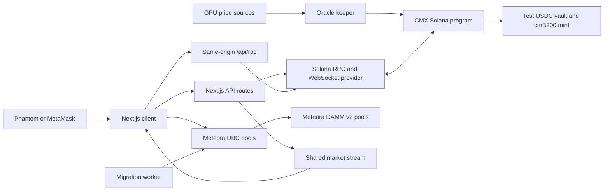
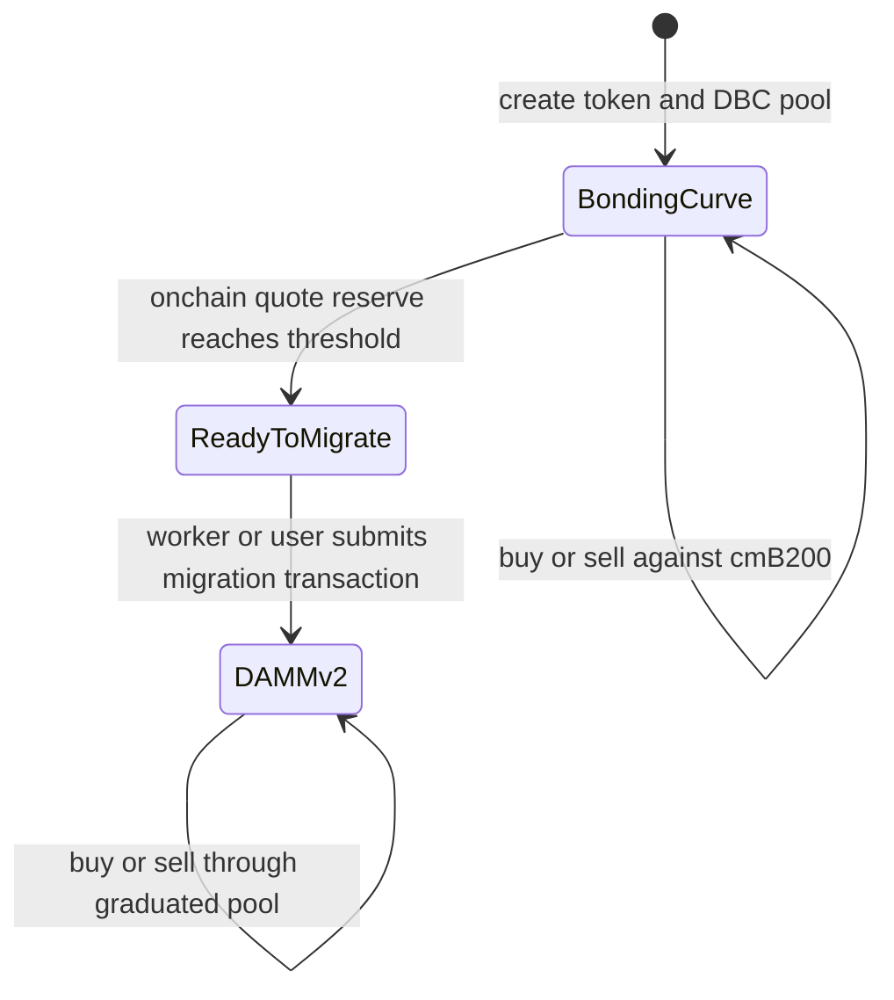

# Compute Exchange (CMX)

Compute Exchange is a Solana Devnet application for creating and trading token markets quoted in **cmB200**, a token whose mint and redemption price follows a B200 GPU-hour reference. Token launches use [Meteora Dynamic Bonding Curve](https://github.com/MeteoraAg/dynamic-bonding-curve); graduated markets move to DAMM v2.

**[Open the Devnet app](https://cmx-compute-market-production.up.railway.app/)** · [Explore markets](https://cmx-compute-market-production.up.railway.app/markets) · [Launch a token](https://cmx-compute-market-production.up.railway.app/launch)

> **Status:** This is a Devnet prototype. Tokens, SOL, and test USDC shown in the app are Devnet assets. The network switch exposes a Mainnet view, but Mainnet trading remains unavailable until a separate manifest, program deployment, real quote asset, and production controls exist. See [Mainnet work](#mainnet-work).

## What the prototype does

- Tracks reference GPU-hour prices for B200, H200, H100, A100, and RTX 5090. The B200 feed is written onchain by a keeper and drives cmB200 mint and redemption quotes.
- Mints cmB200 against Devnet test USDC and burns cmB200 to redeem from the corresponding quote vault. The program charges a 0.30% fee. Redemption depends on the vault's actual reserves; an oracle price alone does not guarantee liquidity or a peg.
- Creates fixed-supply SPL tokens paired with cmB200 on Meteora DBC. The active Devnet configuration targets a **447 cmB200 opening market cap** and **6,166 cmB200 at graduation**, with a **1.25% DBC trading fee**. Those are quote-token targets; their USD equivalents move with the B200 reference price. Existing pools retain the configuration with which they were created.
- Lets visitors discover markets, search by name, ticker, mint, or pool address, sort by market cap, launch time, or recent volume, and trade before and after graduation.
- Builds first-party price candles, volume bars, and a trade tape from confirmed onchain swaps. Market pages preserve the same URL when liquidity moves from DBC to DAMM v2.
- Runs a separate Devnet migration worker that watches curve accounts and submits permissionless DAMM v2 migrations with a funded fee-payer wallet. A user can still migrate manually if the worker is unavailable.

## Architecture



| Layer | Responsibility | Main files |
| --- | --- | --- |
| Onchain program | Index feeds, quote vaults, test faucet, cmB200 mint and redemption, fees | [`programs/gpu_market/src/lib.rs`](programs/gpu_market/src/lib.rs) |
| Wallet client | Transaction construction, local balance checks, DBC and DAMM v2 trading | [`lib/chain-client.ts`](lib/chain-client.ts), [`lib/solana-wallet.ts`](lib/solana-wallet.ts) |
| Market indexer | Pool discovery, current state, transaction-derived swaps, caches | [`lib/dbc-markets.ts`](lib/dbc-markets.ts) |
| Live transport | WebSocket updates, confirmed-chain reconciliation, Server-Sent Events | [`lib/market-live.ts`](lib/market-live.ts), [`app/api/markets/[address]/stream/route.ts`](app/api/markets/%5Baddress%5D/stream/route.ts) |
| Migration worker | Eligibility scans, account subscriptions, guarded transaction submission | [`scripts/auto-migrate.mjs`](scripts/auto-migrate.mjs), [`scripts/auto-migrate-core.mjs`](scripts/auto-migrate-core.mjs) |
| Deployment manifest | Network addresses, curve targets, prior DBC configs | [`deployment/devnet.json`](deployment/devnet.json) |

The browser sends Solana JSON-RPC calls through `/api/rpc`, so the provider key stays in server variables. Transaction confirmation polls HTTP signature status; the proxy does not provide a browser WebSocket. Market data uses a separate server-side WebSocket subscription and streams updates to browsers over SSE. Historical swaps are reconstructed from pool-vault token balance changes, deduplicated by signature, and cached to limit repeat RPC reads.

For the price, asset, and trust boundaries, see the [technical architecture](docs/architecture.md).

## Market lifecycle



The threshold makes migration **eligible**; it does not move funds by itself. The migration is a separate Solana transaction that creates the DAMM v2 pool. The worker's WebSocket path aims to submit quickly, while a slower scan recovers missed updates and restarts. Network confirmation and pool availability have no fixed three-second guarantee. Read [automatic migration operations](docs/auto-migration.md) for signer, genesis-hash, and deployment details.

At the curve boundary, buys use Meteora `swapQuote2` / `swap2` with `PartialFill`. Only the amount the curve can accept is spent. The market page combines pre- and post-migration trades in one chart; it labels volume as **recent volume** because it is derived from a bounded trade history rather than an all-time index.

## Run locally

Requirements: Node.js 20.19 or newer, npm, and a Solana Devnet wallet for signed flows.

```bash
git clone https://github.com/hamzaskewl/cmx-compute-market.git
cd cmx-compute-market
npm ci
cp .env.example .env.local
npm run dev
```

Open `http://localhost:3000`. The checked-in Devnet manifest lets the interface read existing deployments. For reliable market indexing and wallet transactions, set `SOLANA_DEVNET_RPC_URL` and `SOLANA_DEVNET_WSS_URL` in `.env.local` to matching Devnet endpoints. Use `SOLANA_CLUSTER=devnet`. The public Devnet RPC is a fallback for local development and can throttle pool scans.

| Variable | Purpose |
| --- | --- |
| `SOLANA_DEVNET_RPC_URL` | Server-side Devnet HTTP RPC; also backs browser calls through `/api/rpc` |
| `SOLANA_DEVNET_WSS_URL` | Server-side Devnet market subscriptions |
| `SOLANA_MAINNET_RPC_URL`, `SOLANA_MAINNET_WSS_URL` | Reserved for a separate Mainnet deployment manifest |
| `SOLANA_CLUSTER` | Default selected cluster; Devnet unless configured otherwise |
| `MIGRATOR_KEYPAIR_JSON` | Worker fee-payer secret, only in the separate worker service |

Keep provider keys, wallet secret keys, and signer JSON out of Git and out of `NEXT_PUBLIC_*` variables. The Devnet manifest contains public addresses, not private keys.

## Build and checks

```bash
npm run lint
npm run build
node --test tests/auto-migrate.test.mjs
```

Additional live smoke commands are `npm run test:devnet`, `npm run test:dbc`, and `npm run test:live`. They contact Devnet and may require a local server, funded wallet, or deployed accounts; read the scripts before running them. The Anchor program test in [`tests/gpu-market.mjs`](tests/gpu-market.mjs) requires a local validator and built program binary.

The web service uses the root [`Dockerfile`](Dockerfile) and [`railway.json`](railway.json). The migration worker is a **separate** Railway service staged by [`scripts/stage-migrator.mjs`](scripts/stage-migrator.mjs) with [`Dockerfile.migrator`](Dockerfile.migrator); it should have no public domain and one replica per cluster. The worker checks the RPC genesis hash before signing. See [worker setup and operations](docs/auto-migration.md).

For failed RPC calls, delayed confirmations, missing markets, and migration checks, use the [Devnet troubleshooting guide](docs/troubleshooting.md).

## Mainnet work

The repository still has a Devnet manifest only. The [Mainnet launch runbook](docs/mainnet-launch.md) now prepares a distinct program ID, Circle native Solana USDC collateral, CMX fee routing, a mainnet DBC setup path, and a migration signer tied to the fee recipient. No Mainnet program or DBC config has been deployed. A public launch still needs a built and independently reviewed program, a funded and protected signer, a reserve policy, the Mainnet manifest, and full buy, sell, graduation, and post-graduation tests on that deployment. The Devnet faucet and test USDC remain demonstration assets.

## Repository map

```text
app/                 Next.js pages and API routes
components/          Wallet, launchpad, market, and chart UI
lib/                 Solana client, market indexing, live stream, and pricing logic
programs/gpu_market/ Anchor program
deployment/          Public per-cluster deployment manifests
scripts/             Setup, keeper, and migration worker entry points
tests/               Program, migration, and Devnet smoke tests
docs/                Operator documentation
```
