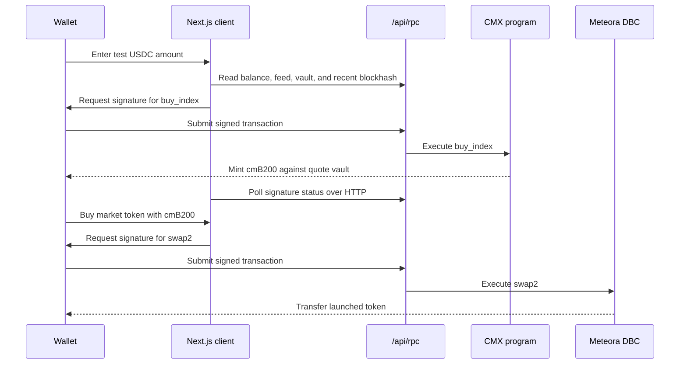
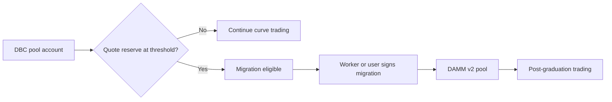

# Technical architecture

CMX has two onchain layers. The CMX Anchor program issues GPU index tokens such as cmB200 against a quote vault. Meteora DBC and DAMM v2 own the independent token markets quoted in cmB200. The Next.js app connects the two layers; it is not the settlement authority for either.

## Assets and prices

| Value | Source | Used for |
| --- | --- | --- |
| B200 GPU-hour reference | Ornn API, then an authorized keeper update to the CMX index feed | cmB200 mint and redemption calculations |
| cmB200 balance | SPL token account | Paying for DBC or DAMM v2 market tokens |
| Market token price | Current Meteora pool state and confirmed swaps | Trade quote, market cap, and chart |
| USD display | B200 reference multiplied by a cmB200-denominated value | Approximate display only; no USD settlement |

The keeper in [`scripts/keeper.mjs`](../scripts/keeper.mjs) reads Ornn's daily index response and submits `updatePrice` for each registered feed. The web app reads Ornn separately for the reference display. The onchain program in [`programs/gpu_market/src/lib.rs`](../programs/gpu_market/src/lib.rs) checks feed freshness before minting or redeeming. If the keeper stops or the source is unavailable, the app must not treat an old display price as permission to trade.

Index minting deposits quote tokens into that index's vault, deducts the protocol fee, and mints the corresponding index amount at the feed price. Redemption burns index tokens and pays only from available vault reserves. The Devnet quote mint is test USDC. The vault is one-sided: a published GPU reference price does not itself fund redemptions or create a stable peg.

The browser RPC is a same-origin HTTP route. It forwards permitted Solana methods to the configured server-side provider and never sends the provider URL to the browser bundle. Because it does not proxy WebSockets, wallet transaction confirmation uses HTTP signature-status polling. The separate market stream runs on the server and may use the provider WebSocket.

## Market discovery and candles

[`lib/dbc-markets.ts`](../lib/dbc-markets.ts) scans the active DBC config and any prior configs recorded in the deployment manifest. A lightweight pass returns current pool identity, price, cap, and graduation state. A background pass obtains recent signatures and confirmed transactions to calculate volume, launch time, and history. Confirmed transaction balance deltas, rather than UI estimates, determine buy/sell direction and executed price. This history is bounded and cached; recent volume is not an all-time volume claim.

For an open market, [`lib/market-live.ts`](../lib/market-live.ts) shares one server-side log subscription across viewers and reconciles confirmed signatures every three seconds. The stream endpoint sends snapshots and trades through Server-Sent Events. [`lib/market-candles.ts`](../lib/market-candles.ts) aggregates swaps into OHLC buckets. No synthetic swap or volume is inserted in an empty bucket. A graduated market reads both its DBC history and its DAMM v2 pool history at the same market URL.

## Migration and trust boundaries

The worker in [`scripts/auto-migrate.mjs`](../scripts/auto-migrate.mjs) is a separate process with a separate fee-payer secret. It checks the RPC genesis hash, configuration, exact reserve threshold, and current migrated state before signing. Mainnet signing also requires an explicit flag and a Mainnet manifest. The worker cannot be treated as a guarantee that migration will complete within a fixed time: RPC delivery, fees, Solana confirmation, and DAMM pool creation remain external dependencies. See [migration operations](auto-migration.md).

The CMX program, Ornn source, keeper authority, RPC provider, Meteora programs, and worker signer are separate trust boundaries. A production deployment needs a reviewed policy for each, especially feed authority, redemption reserves, signer custody, fee routing, and recovery during provider outages. The checked-in `deployment/devnet.json` contains public addresses and curve targets; it is not a secret store.
